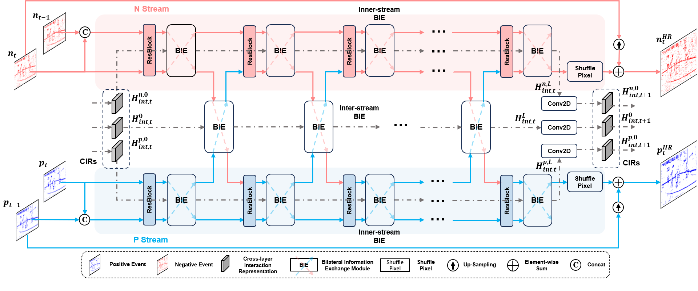

# Bilateral Event Mining and Complementary for Event Stream Super-Resolution

**Official PyTorch Implementation of the CVPR 2024 Oral Paper (only 90 of the 2719 accepted papers 🔥):**

Bilateral Event Mining and Complementary for Event Stream Super-Resolution

<p align="left">
    
  <br>
</p>

## Dataset

Please follow the instructions from directory `generate_dataset` to prepare the synthetic and real-world dataset.

## Pretrained model

Some pretrained model are in the `pretrain` folder.

## Training and Inference

Please check the file `scripts\train_ours.sh` and `scripts\infer_ours.sh` for training and inference. 

## Citation

If you find this work helpful, please consider citing our paper.

```latex
@inproceedings{huang2024bilateral,
  title={Bilateral Event Mining and Complementary for Event Stream Super-Resolution},
  author={Huang, Zhilin and Liang, Quanmin and Yu, Yijie and Qin, Chujun and Zheng, Xiawu and Huang, Kai and Zhou, Zikun and Yang, Wenming},
  booktitle={Proceedings of the IEEE/CVF Conference on Computer Vision and Pattern Recognition},
  pages={34--43},
  year={2024}
}
```

## Contact

If you have any problem about the released code, please contact me with email (liangqm5@mail2.sysu.edu.cn).
